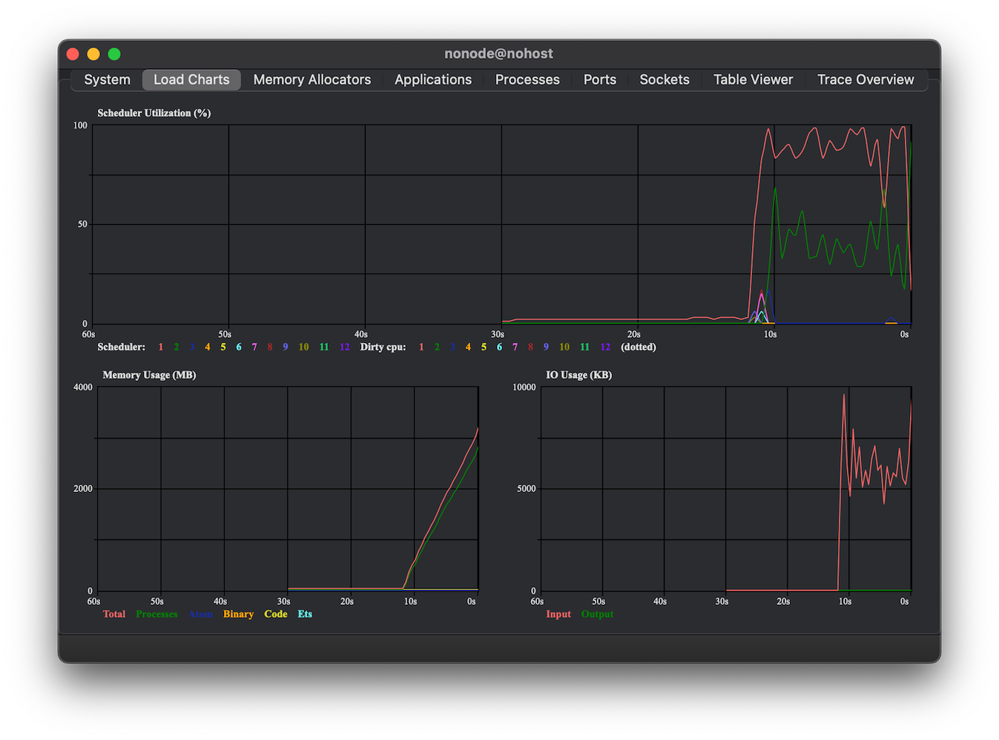
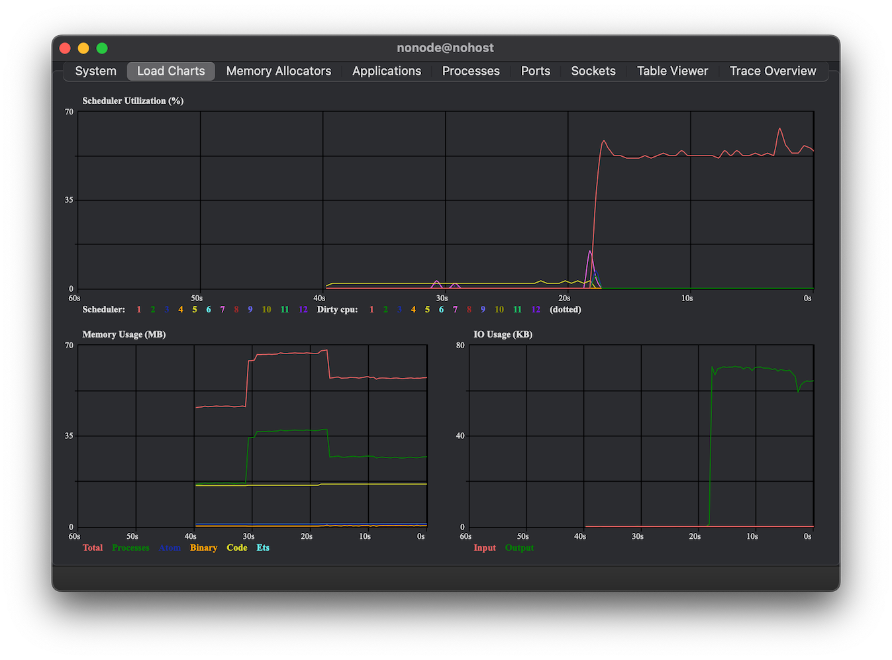

# Exile

[](https://github.com/akash-akya/exile/actions/workflows/ci.yaml)
[](https://hex.pm/packages/exile)
[](https://hexdocs.pm/exile/)

Exile is a powerful Elixir library for running external programs with proper back-pressure and streaming capabilities. Think of it as Ports done right - giving you fine-grained control over input/output streams while preventing memory issues.

## Key Features

- Stream-based API with proper back-pressure
- Memory-efficient handling of large outputs
- Selective control over stdin/stdout/stderr
- Clean process management (no zombies!)
- No external dependencies or middleware programs
- Built on battle-tested POSIX system calls

## Quick Installation

```elixir
def deps do
  [
    {:exile, "~> x.x.x"} # Replace with latest version
  ]
end
```


## Quick Start Examples

### Basic Command Execution
```elixir
# Simple output
Exile.stream!(~w(echo Hello World!))
|> Enum.into("") # "Hello World!\n"

# With input to stdin
Exile.stream!(~w(cat), input: ["Hello ", "Back!"])
|> Enum.into("") # "Hello Back!"

# Stream as input
input_stream = Stream.map(1..10, fn num -> "#{num}\n" end)
Exile.stream!(~w(cat), input: input_stream)
|> Enum.into("")  # "1\n2\n3\n4\n5\n6\n7\n8\n9\n10\n"

# With stderr
Exile.stream!(["sh", "-c", "echo stdout && echo stderr >&2"], stderr: :consume)
|> Enum.to_list()  # [{:stdout, "stdout\n"}, {:stderr, "stderr\n"}]

# With stderr redirected to stdout
Exile.stream!(["sh", "-c", "echo stdout && echo stderr >&2"], stderr: :redirect_to_stdout)
|> Enum.to_list()  # ["stdout\nstderr\n"]
```

## Why Exile?

### The Problem with Ports
Traditional Elixir ports have several limitations:
- No back-pressure → memory exhaustion with large outputs
- Can't selectively close stdin
- Potential zombie processes
- Message-box flooding

### Exile's Solution
Exile solves these by:
- Using non-blocking async I/O
- Implementing proper back-pressure
- Providing fine-grained stream control
- Handling process cleanup
- Zero external dependencies

## Performance Comparison

Memory usage when reading from `/dev/random`:

**With Port:**
```elixir
# Memory grows unbounded!
Port.open({:spawn_executable, "/bin/cat"}, [{:args, ["/dev/random"]}, {:line, 10}, :binary, :use_stdio])
```



**With Exile:**
```elixir
# Stable memory usage
Exile.stream!(~w(cat /dev/random))
|> Enum.each(fn data ->
  IO.puts(IO.iodata_length(data))
end)
```



## Advanced Examples

### Working with Large Data Streams
```elixir
# Process large data with controlled chunk size
Exile.stream!(~w(cat huge_file.log), max_chunk_size: 65536)
|> Stream.map(&process_batch/1)
|> Stream.run()

# Handle infinite streams
infinite_stream = Stream.repeatedly(fn -> "data\n" end)
Exile.stream!(~w(cat), input: infinite_stream, ignore_epipe: true) # we need to ignore epipe since we are terminating the program before the input completes
|> Stream.take(3)
|> Enum.into("") # "data\ndata\n..."
```

### Media Processing
```elixir
# Extract audio from video
Exile.stream!(~w(ffmpeg -i pipe:0 -f mp3 pipe:1), input: File.stream!("video.mkv", [], 65_535))
|> Stream.into(File.stream!("audio.mp3"))
|> Stream.run()

# Convert video format with progress on stderr
Exile.stream!(["ffmpeg", "-i", "input.mp4", "-c:v", "libx264", "pipe:1"], stderr: :consume)
|> Enum.each(fn
  {:stdout, data} -> File.write!("output.mp4", data, [:append])
  {:stderr, data} -> IO.write(:stderr, data) # Show progress
end)
```


### Exit Status Handling

```elixir
# Using stream!/2 (raises on error non-zero exit status)
try do
  Exile.stream!(["sh", "-c", "exit 10"])
  |> Enum.to_list()
rescue
  e in Exile.Stream.AbnormalExit ->
    IO.puts("Failed with status: #{e.exit_status}")
end # "Failed with status: 10"

# Using stream/2 (returns exit status)
Exile.stream(["sh", "-c", "exit 10"])
|> Enum.to_list()  # [..., {:exit, {:status, 10}}]
```

### Wait for Input Close
```elixir
# base64 waits for input EOF before producing output
Exile.stream!(~w(base64), input: ["abcdef"])
|> Enum.into("") # "YWJjZGVm\n"
```

### Collectable as input (Callback)

```elixir
# Using input callback
Exile.stream!(~w(cat), input: fn sink ->
  Stream.repeatedly(fn -> "data\n" end)
  |> Stream.take(2)
  |> Stream.into(sink)
  |> Stream.run()
end)
|> Enum.into("") # "data\ndata\n"
```

## Alternative Libraries

For simpler use cases where NIF-based solutions aren't preferred, consider using [ExCmd](https://github.com/akash-akya/ex_cmd), which provides similar functionality using pure Elixir.

## Support & Contribution

- [Documentation](https://hexdocs.pm/exile/)
- [GitHub Issues](https://github.com/akash-akya/exile/issues)

## License

Copyright (c) 2020-2025 Akash Hiremath.
Released under Apache License 2.0. See [LICENSE](LICENSE.md) for details.
